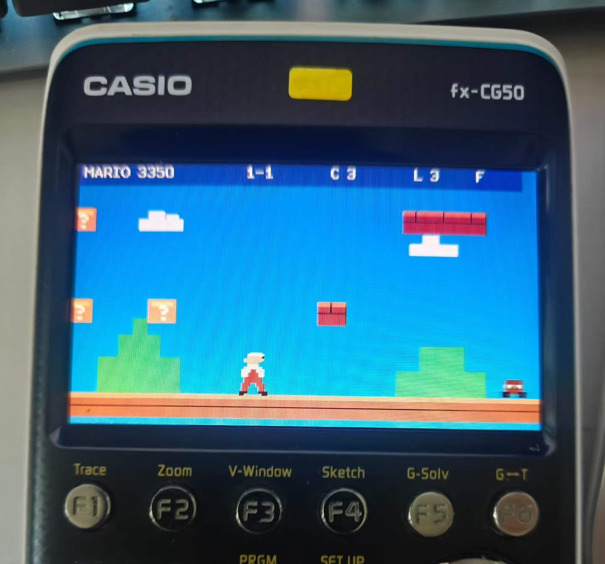
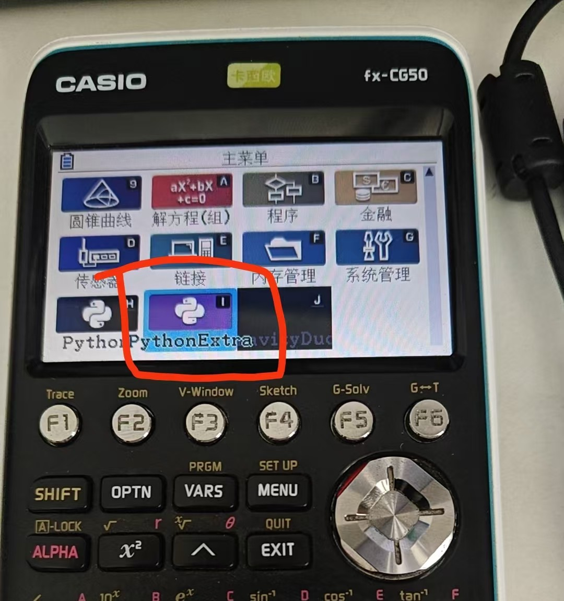
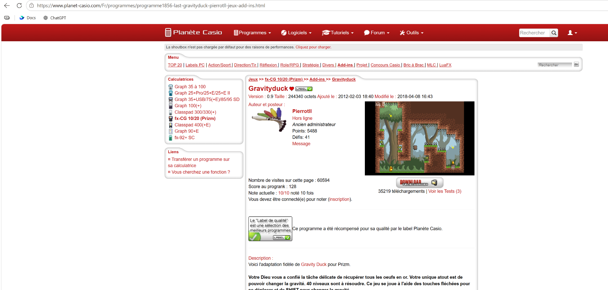
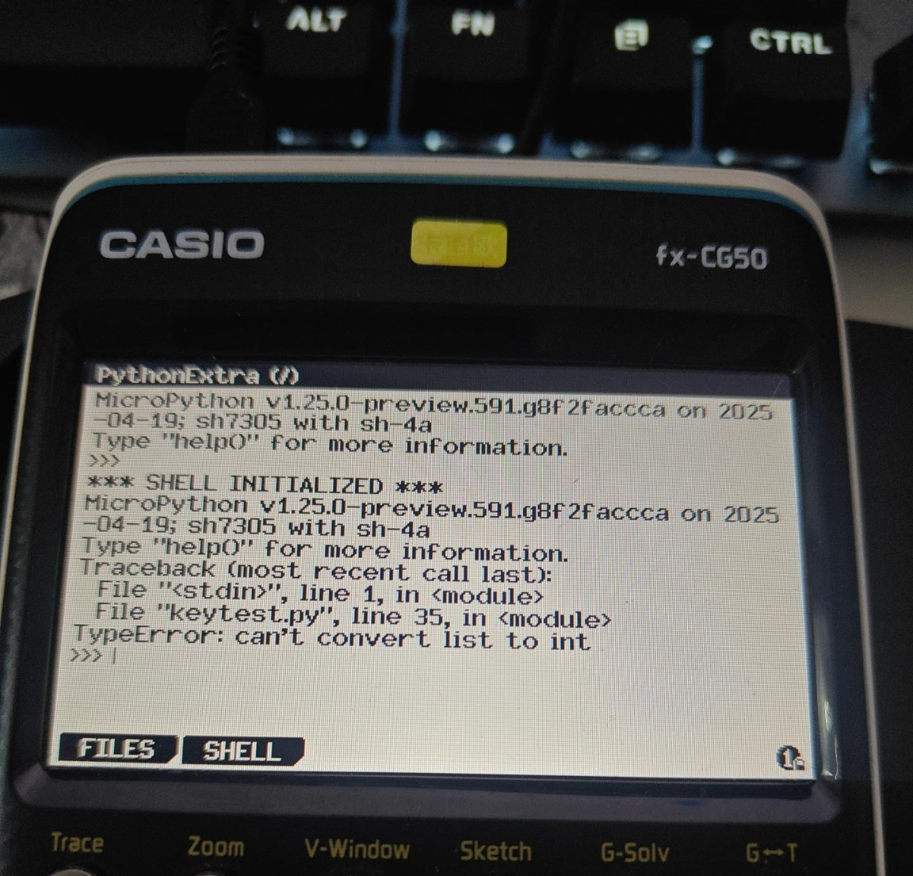

# fx-CG50 第三方程序、游戏开发与移植中文指南

> 面向 Casio fx-CG50 的中文入门资料：从安装现成 `.g3a`、使用 PythonExtra 运行自己的 `.py`，到理解 `C + fxSDK + gint` 原生开发与开源小游戏移植。

**版本：** 1.0（2026-09-13）<br>
**实测环境：** Casio fx-CG50 + Windows 10

- [下载排版完整的 Word 版教程](docs/downloads/fx-CG50-Chinese-Guide-v1.0.docx)
- [直接查看 Mario 风格教学 Demo](examples/mario/mario_cg50_v3.py)
- [先运行最小按键测试](examples/key-test/keytest_v2.py)
- [查看专题文档目录](docs/README.md)



## 这是什么？

这个仓库不是某一个游戏的“下载站”，而是一份尽量把原理讲清楚的中文指南。

如果你手里有一台 fx-CG50，你可以把它理解成一台资源受限、但可以安装第三方 Add-in、运行 Python、也可以运行原生 C 程序的小型计算平台。

本文从三个层次展开：

1. **先会用**：下载别人已经编译好的 `.g3a`，复制进计算器直接运行；
2. **再会写**：安装 PythonExtra，用 Python 编写自己的程序和小游戏；
3. **再理解底层**：认识 fxSDK、gint、交叉编译和原生 `.g3a`，并了解如何把网上的开源小游戏移植到 fx-CG50。

> **本文电脑端操作基于 Windows 10 实测。** 计算器实测设备为 **Casio fx-CG50**。

---

## 1. 支持设备与本文边界

### 本文实测

- 计算器：Casio fx-CG50
- 电脑系统：Windows 10
- 连接方式：USB 数据线 / USB Flash 模式
- Python 方案：PythonExtra / MicroPython
- 原生 Add-in：`.g3a`

fxSDK / gint 还支持部分 fx-CG10 / fx-CG20 等 fx-CG 系列机型，但不同机型、不同 OS 版本之间可能存在差异。**不要简单把“fx-CG50 以上型号”理解成必然兼容**；尤其新一代产品应单独确认工具链和 Add-in 兼容性。

---

## 2. 先理解一件事：fx-CG50 到底能运行什么？

最重要的技术关系是下面这张图：

```text
                         fx-CG50
                            │
                     Casio Add-in 机制
                            │
                          .g3a
                  ┌─────────┴─────────┐
                  │                   │
          PythonExtra.g3a         原生 .g3a
                  │                   │
             MicroPython            C 程序
                  │                   │
              your.py        fxSDK + gint +
                              sh-elf-gcc
                  │                   │
                  └────────► fx-CG50 ◄┘
```

因此，**PythonExtra 和 `.g3a` 并不是两个完全平级的东西**。

- `.g3a` 是 fx-CG 系列原生 Add-in 的一种应用文件格式；
- PythonExtra **自己就是一个 `.g3a` Add-in**；
- PythonExtra 的作用，是在这个 Add-in 里面提供一个更适合折腾的 MicroPython 环境；
- 你写的 `.py` 再由 PythonExtra 解释执行；
- 如果追求更高性能，则可以把程序逻辑移植到 C，再使用 fxSDK / gint 工具链编译成原生 `.g3a`。



上图中可以同时看到：

- **Python**：Casio 自带 Python 应用；
- **PythonExtra**：社区制作的 `.g3a` Add-in；
- **GravityDuck**：直接运行的游戏类 `.g3a` Add-in。

这三者放在同一个主菜单里，非常直观地说明了 fx-CG50 的软件生态。

---

## 3. Windows 10 如何把 fx-CG50 连接到电脑

这是后面所有操作的基础。

### 3.1 准备 USB 数据线

线缆必须支持数据传输。只支持充电的线不能完成文件复制。

### 3.2 连接计算器与 Windows 10 电脑

将 fx-CG50 通过 USB 连接到电脑。计算器进入连接界面后，选择 **USB Flash**（不同系统版本显示可能略有差别）。

正常情况下，Windows 会把计算器识别成一个可移动存储设备。

### 3.3 什么叫“根目录”？

打开计算器存储盘后，最外层就是根目录。可以把它理解为：

```text
fx-CG50 storage/
├── PythonExtra.g3a
├── GravityDuck.g3a
├── mario_cg50_v3.py
├── @MainMem/
└── ...
```

对于 Add-in，最稳妥的理解是：**把 `.g3a` 放在存储内存根目录**。Casio 官方文档也说明，Add-in 文件位于存储内存中，若 `.g3a/.g3l` 被放入 `@MainMem`，系统断开 USB 时也会把它移动到存储内存根目录。

复制完成后，建议先在 Windows 中安全弹出设备，再断开 USB。

---

## 4. 路线 A：直接安装别人做好的 `.g3a`

如果你只是想先体验“计算器真的可以装第三方 App”，这是最简单的路线。

### 案例：GravityDuck

原作者页面：

<https://www.planet-casio.com/Fr/programmes/programme1856-last-gravityduck-pierrotll-jeux-add-ins.html>



基本流程：

```text
Planet Casio
    ↓
Download
    ↓
下载压缩包
    ↓
解压
    ↓
找到 GravityDuck.g3a
    ↓
USB 连接 fx-CG50
    ↓
复制到计算器存储根目录
    ↓
安全弹出
    ↓
MENU 中出现 GravityDuck
    ↓
EXE 运行
```

这里有一个非常关键的认知：

> `.g3a` 不是“游戏专用格式”，而是 Add-in 应用格式。游戏、工具、专业计算程序都可以做成 `.g3a`。

本仓库不重新分发 GravityDuck 本体，建议始终从原作者页面下载。

---

## 5. 路线 B：PythonExtra + 自己写 `.py`

如果你想快速写自己的小游戏或交互程序，PythonExtra 是非常合适的入口。

PythonExtra 是社区维护的 MicroPython 方案，面向 fx-CG50 及相关 Casio 图形计算器。它提供更适合图形与实时输入的能力，并能使用 `gint` 相关接口。

项目页面：

<https://github.com/tangenty42/PythonExtra>

### 5.1 安装思路

```text
下载 PythonExtra.g3a
    ↓
复制到 fx-CG50 存储根目录
    ↓
主菜单出现 PythonExtra
    ↓
把自己的 xxx.py 复制进计算器
    ↓
PythonExtra → FILES
    ↓
选择脚本 → EXE
```

### 5.2 为什么不直接依赖官方 Python？

官方 Python 更偏向基础编程与教学。实时游戏通常还需要：

- 连续轮询按键状态；
- 同时检测多个按键；
- 更直接的屏幕绘图；
- 游戏循环中的快速刷新；
- 更灵活的低层接口。

PythonExtra 在这类场景下更适合实验。

### 5.3 一个最小的多键检测思路

不同 PythonExtra 构建的 API 可能存在差异。我们在实机测试中发现，直接逐个调用 `keydown()` 最稳妥：

```python
import gint

right = gint.keydown(gint.KEY_RIGHT)
run   = gint.keydown(gint.KEY_SHIFT)
jump  = gint.keydown(gint.KEY_EXE)

if right and run and jump:
    # 三键同时按下
    pass
```

我们在 fx-CG50 实机确认了 `RIGHT + SHIFT + EXE` 可以同时检测。

示例代码见：[`examples/key-test/keytest_v2.py`](examples/key-test/keytest_v2.py)

---

## 6. 实战案例：横版平台游戏 Demo


这个案例最初只是为了验证一个问题：

> 一台 fx-CG50，能不能用 PythonExtra 做出带助跑、跳跃、碰撞、滚屏、敌人和道具的横版平台游戏？

答案是：**可以。**

Demo 采用自绘图形和自写代码，用于教学与技术验证，不包含 Nintendo ROM、原版音频或从商业游戏中提取的素材。

### 操作

- 左 / 右：移动
- SHIFT：加速（类似传统平台游戏中的 B）
- EXE：跳跃（类似 A）
- 大体型状态下：下方向键可用于蹲下
- 火焰状态下：SHIFT 的按下沿可触发火球

### 核心结构

```text
读取输入
   ↓
更新水平速度 / 跳跃状态
   ↓
固定时间步更新物理
   ↓
碰撞检测
   ↓
更新敌人 / 道具 / 火球
   ↓
更新 Camera
   ↓
只绘制可见 Tile / Sprite
   ↓
刷新屏幕
```

其中有几个非常值得学习的点：

- **Tile Map**：地图不是一张巨大的图片，而是用小块 Tile 拼出来；
- **Fixed Timestep**：让物理速度不直接依赖渲染速度；
- **Input Edge Latching**：避免某次渲染循环没有进入物理步时丢失“刚按下”的跳跃/发射事件；
- **Camera**：世界坐标和屏幕坐标分离；
- **Visible-only Rendering**：只画当前视野附近的 Tile；
- **State Machine**：Small / Super / Fire 等状态切换；
- **Fixed-point / Integer-oriented Physics**：尽量减少在受限平台上的额外开销。

完整实机版本见：

[`examples/mario/mario_cg50_v3.py`](examples/mario/mario_cg50_v3.py)

> 这是教学 Demo，不追求对商业游戏的逐像素复刻。

---

## 7. 路线 C：原生 C + fxSDK + gint → `.g3a`

当 Python 原型已经验证玩法、但性能开始成为瓶颈时，可以进入原生开发路线。

```text
game.c
  │
  ├── 游戏逻辑
  │
  └── gint
       ├── 显示
       ├── 键盘
       ├── Timer
       └── 硬件接口
            ↓
      sh-elf-gcc
            ↓
          fxSDK
            ↓
         game.g3a
            ↓
          fx-CG50
```

可以把几个名词先这样理解：

| 名称 | 作用 |
|---|---|
| C | 写原生程序的语言之一 |
| gint | 面向 Casio 图形计算器的底层运行时 / 硬件与图形接口库 |
| sh-elf-gcc | 在电脑上为 SuperH/SH 架构目标生成机器码的交叉编译器 |
| fxSDK | 组织 Add-in 项目、资源转换和构建流程的开发工具包 |
| `.g3a` | 最终安装到 fx-CG50 的 Add-in 文件 |

fxSDK 官方/社区文档通常以 Linux 环境为主。Windows 用户常见做法是借助 **WSL** 建立 Linux 工具链。本文第一版先讲原理，不把完整工具链安装作为必做步骤。

进一步阅读：

- fxSDK：<https://github.com/lephe/Fx-SDK>
- gint：<https://gitea.planet-casio.com/Lephenixnoir/gint>

---

## 8. 从 GitHub 到 fx-CG50：开源小游戏如何“移植”？

这里最容易产生一个误解：**并不是把网上某个游戏“点一下就编译成 Python 或 C”**。

真正做的是 **port / 移植**：尽量保留平台无关的游戏逻辑，替换与 PC、SDL、pygame、操作系统相关的部分。

### 情况 A：原项目是 Python / pygame

例如：

```text
pygame.display      → gint 绘图
pygame keyboard     → gint.keydown()
pygame Clock        → MicroPython time / 计时逻辑
pygame Sprite       → 自己的 Sprite 数据和绘制函数
```

而这些内容通常可以较多保留：

```text
地图
物理
碰撞
AI
状态机
关卡数据
```

### 情况 B：原项目是 C / C++

如果项目结构清晰，可能更适合做原生 source port：

```text
开源 C/C++ 游戏
    ↓
保留核心逻辑
    ↓
替换图形 / 输入 / 音频 / 文件系统平台层
    ↓
gint
    ↓
fxSDK + 交叉编译
    ↓
game.g3a
```

### 情况 C：真正的 FC / NES ROM

如果手里的是：

```text
xxx.nes
```

那是 ROM，不是普通源码。想直接运行 ROM，本质上要做一个 **NES Emulator**，需要模拟/实现包括 CPU、PPU、内存映射、手柄甚至音频在内的整套硬件行为。

这和“移植一份开源游戏源码”不是一个难度级别。

因此更现实的学习路线通常是：

> 找到许可证允许的开源源码 → 看懂游戏逻辑 → 替换平台层 → 适配 fx-CG50。

详见：[`docs/porting-guide.md`](docs/porting-guide.md)

---

## 9. PythonExtra 和原生 C 怎么选？

| 对比 | PythonExtra | C + fxSDK/gint |
|---|---|---|
| 上手难度 | 低 | 高 |
| 修改速度 | 很快 | 相对慢 |
| 实机迭代 | 方便 | 需要重新编译 `.g3a` |
| 性能 | 中等 | 高 |
| 适合快速 Demo | 很适合 | 可以，但成本更高 |
| 适合复杂/高帧率游戏 | 较受限 | 更适合 |
| 最终文件 | `.py`（由 PythonExtra 运行） | `.g3a` |

一个很实用的工程路线是：

> **Python 做原型，C 做高性能最终版。**

---

## 10. 我们实际踩过的坑

### 坑 1：`.py` 不是 `.g3a`

`.py` 需要解释器运行；`.g3a` 是 Add-in 应用。不能把一个 Python 文件简单“改后缀”变成高性能原生 Add-in。

### 坑 2：PythonExtra 本身就是 `.g3a`

所以“PythonExtra 路线”和“`.g3a` 路线”并不是完全独立的两个世界。

### 坑 3：PC 的 pygame ≠ fx-CG50 的 PythonExtra

PC 上的 pygame 代码通常不能原封不动复制到 fx-CG50。平台相关的显示、键盘、音频、时间接口需要替换。

### 坑 4：`keydown_all([...])` 在某些 PythonExtra 构建中会报错

我们的实机曾出现：

```text
TypeError: can't convert list to int
```

解决方法是逐键调用 `gint.keydown()`，然后在 Python 里组合布尔条件。



### 坑 5：Python 慢，不等于 fx-CG50 硬件本身“很弱”

解释器、绘制 API 调用次数、每帧处理的 Tile 数量、屏幕分辨率都会影响最终速度。改成原生 C 后，性能模型会完全不同。

### 坑 6：画面看起来不对，不一定是碰撞逻辑出错

横版游戏同时涉及世界坐标、屏幕坐标、Sprite 锚点与碰撞盒。角色视觉位置偏移时，先分别画出 Sprite 边界和碰撞盒，确认到底是渲染偏移，还是物理坐标真的算错。

### 坑 7：USB 线可能只能充电

如果 Windows 看不到计算器存储盘，先确认线缆真的支持数据传输。

---

## 11. 开源与版权

“开源代码”不等于“所有游戏素材都开源”。

移植网上项目时至少要分清：

- 源代码许可证：MIT / BSD / GPL / Apache 等；
- 图片、音乐、字体是否有单独授权；
- 商业游戏 ROM 是否允许再分发；
- 游戏品牌、角色、美术是否属于原权利方。

本仓库：

- 不提供商业游戏 ROM；
- 不重新分发 GravityDuck 二进制，使用原作者页面作为下载来源；
- 平台游戏 Demo 仅作为技术教学与实验代码；
- 鼓励后续把引擎替换为原创角色、美术和关卡。

---

## 12. 仓库结构

```text
fx-CG50-Chinese-Guide/
├── README.md
├── LICENSE
├── CONTRIBUTING.md
├── THIRD_PARTY_NOTICES.md
├── docs/
│   ├── README.md
│   ├── images/
│   │   ├── cg50-menu.jpg
│   │   ├── gravityduck-page.png
│   │   ├── mario-running.jpg
│   │   └── pythonextra-keydown-error.jpg
│   ├── downloads/
│   │   └── fx-CG50-Chinese-Guide-v1.0.docx
│   ├── g3a-history.md
│   ├── pythonextra.md
│   └── porting-guide.md
├── examples/
│   ├── key-test/
│   │   └── keytest_v2.py
│   └── mario/
│       └── mario_cg50_v3.py
└── references/
    └── links.md
```

---

## 13. 推荐学习顺序

如果你第一次接触这个平台，建议按这个顺序：

```text
1. 安装现成 GravityDuck.g3a
        ↓
2. 理解 .g3a / Add-in
        ↓
3. 安装 PythonExtra.g3a
        ↓
4. 跑通 key-test.py
        ↓
5. 修改一个最小 Python Demo
        ↓
6. 阅读 Mario 平台游戏结构
        ↓
7. 学习开源游戏移植思想
        ↓
8. 再决定是否进入 C + fxSDK + gint
```

核心思想只有一句：

> **先学会运行别人的程序，再学会写自己的程序，最后理解如何把开源程序移植到自己的计算器。**

---

## 参考资料

更完整的链接、官方文档与社区资料整理在：[`references/links.md`](references/links.md)

主要入口包括：

- Casio fx-CG50 官方支持页：<https://www.casio.com/sg/scientific-calculators/support.FX-CG50/>
- PythonExtra：<https://github.com/tangenty42/PythonExtra>
- fxSDK：<https://github.com/lephe/Fx-SDK>
- gint：<https://gitea.planet-casio.com/Lephenixnoir/gint>
- GravityDuck 原作者页面：<https://www.planet-casio.com/Fr/programmes/programme1856-last-gravityduck-pierrotll-jeux-add-ins.html>

---

## License

本仓库采用分范围授权：原创示例代码使用 MIT License；原创文档使用 CC BY 4.0。具体边界以 [`LICENSE`](LICENSE) 和 [`THIRD_PARTY_NOTICES.md`](THIRD_PARTY_NOTICES.md) 为准。第三方项目、名称、链接及素材仍遵循各自原始许可证和权利声明。
